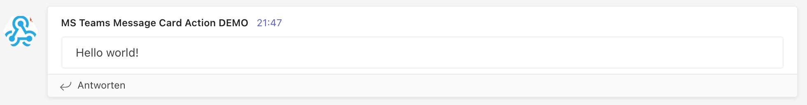

# simbo/msteams-message-card-action

A simple and lightning-fast GitHub action to send notifications as message cards
to an MS Teams webhook by using the [actionable message card JSON format](https://docs.microsoft.com/en-us/outlook/actionable-messages/message-card-reference).

It does not add any custom design. That's all up to you.

You can add buttons by using simple strings with labels followed by URLs (see
[Options](#options)).  
I decided for this simple format to define buttons because this way you can
easily set buttons using workflow variables which can also be invalid and
omitted on purpose.

You can also define complete sections in YAML format following the [section fields definition](https://learn.microsoft.com/en-us/outlook/actionable-messages/message-card-reference#section-fields)
for actionable message cards.

## Usage

Add `simbo/msteams-message-card-action@v1` to your workflow.

### Simple Example

```yml
jobs:
  notify:
    runs-on: ubuntu-latest
    steps:
      - name: 📣 Send teams notification
        uses: simbo/msteams-message-card-action@latest
        with:
          webhook: ${{ secrets.TEAMS_WEBHOOK }}
          message: Hello world!
```

…will produce a message card like this:



### Advanced Example

```yml
jobs:
  notify:
    runs-on: ubuntu-latest
    steps:
      - name: 🪣 Set env vars
        run: |
          echo "MY_SPECIAL_BUTTON=Cool https://this-is-so.cool/" >> $GITHUB_ENV

      - name: 📣 Send teams notification
        uses: simbo/msteams-message-card-action@latest
        env:
          MY_AWESOME_BUTTON: Awesome http://this-is-so.awesome/
        with:
          webhook: ${{ secrets.TEAMS_WEBHOOK }}
          title: Hello world!
          message: <p>This is my <strong>awesome message!</strong></p>
          color: ff69b4
          buttons: |
            Click here! https://whatever.com/foo/
            Or here… https://somewhere.com/bar/
            This button will not be shown as it has no target URL
            https://no-label-no-button.com/
            ${{ env.MY_SPECIAL_BUTTON }}
            ${{ env.MY_AWESOME_BUTTON }}
```

…will produce a message card like this:


### Sections Example

```yml
jobs:
  notify:
    runs-on: ubuntu-latest
    steps:
      - name: 📣 Send teams notification
        uses: simbo/msteams-message-card-action@latest
        with:
          webhook: ${{ secrets.TEAMS_WEBHOOK }}
          title: Hello world!
          message: <p>This is my <strong>awesome message!</strong></p>
          color: ff69b4
          buttons: |
            Click here! https://whatever.com/foo/
            Or here… https://somewhere.com/bar/
          sections: |
            -
              activityTitle: David Claux
              activitySubtitle: 9/13/2016, 3:34pm
              activityImage: https://connectorsdemo.azurewebsites.net/images/MSC12_Oscar_002.jpg
              facts:
                -
                  name: "Board:"
                  value: Name of board
                -
                  name: "List:"
                  value: Name of list
                -
                  name: "Assigned to:"
                  value: (none)
                -
                  name: "Due date:"
                  value: (none)
              text: Lorem ipsum dolor sit amet, consectetur adipiscing elit, sed do eiusmod tempor incididunt ut labore et dolore magna aliqua. Ut enim ad minim veniam, quis nostrud exercitation ullamco laboris nisi ut aliquip ex ea commodo consequat.
```

…will produce a message card like this:


## Options

| Option     | Required | Default | Description                                                                                                                                                                                                              |
| ---------- | -------- | ------- | ------------------------------------------------------------------------------------------------------------------------------------------------------------------------------------------------------------------------ |
| `webhook`  | yes      | `''`    | The MS Teams webhook URL to send the notification to. Obviously required.                                                                                                                                                |
| `title`    | no       | `''`    | The title of your card. Will be omitted by MS Teams if left empty.                                                                                                                                                       |
| `message`  | no       | `''`    | The message content. Supports HTML up to a certain level (interpreted by MS Teams). Can also be empty.                                                                                                                   |
| `color`    | no       | `''`    | The border color of the message card. Will fallback to MS Teams' default color if empty.                                                                                                                                 |
| `buttons`  | no       | `''`    | A multiline string where every line defines an action button for the message card. Each line should contain a label text followed by a HTTP(S) URL. If the line does not match this format, it will be silently omitted. |
| `sections` | no       | `''`    | A multline string representing a YAML definition of [section objects](https://learn.microsoft.com/en-us/outlook/actionable-messages/message-card-reference#section-fields)                                               |

## Development

### Creating a new Version

Use `./release.sh <major|minor|patch>` which will update `package.json` and
create a git tag for the respective version.

A release workflow will pick up the tag when pushed to GitHub, create a release
and move major, minor and latest tags accordingly.

To publish the release into the GitHub marketplace open
[releases](https://github.com/simbo/msteams-message-card-action/releases) and
update the release for marketplace publishing.

## License and Author

[MIT &copy; Simon Lepel](http://simbo.mit-license.org/)
